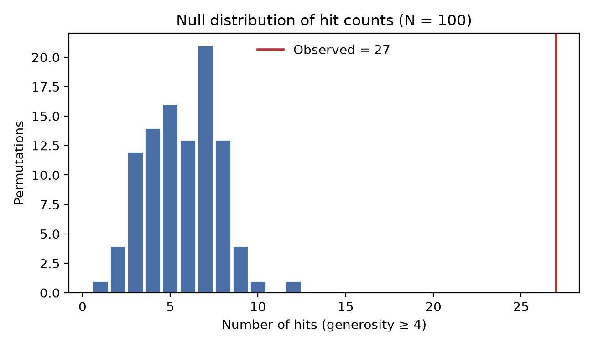

# How surprising are Austro-Tai lookalikes? Meaning-blind permutation tests of Smith’s (2025) reconstructions and of dual-attested Lexibank form inventories

Jeremy Collins

Companion code and data: [github.com/jeremycollinsmpi/austro-tai-llm-test](https://github.com/jeremycollinsmpi/austro-tai-llm-test).

## Abstract

The Austro-Tai hypothesis posits a genetic link between Austronesian and Kra-Dai (Tai-Kadai). Published lexical comparisons are hard to quantify: lists may mix robust etymologies with weakly justified or lookalike-friendly reconstructions, and similarity judgments inflate when meanings are known. I report two meaning-blind permutation screens in which an LLM (`gpt-4.1`, via API) scores segmental form similarity without seeing meanings. **Study 1** audits Alexander D. Smith’s (2025) gloss-aligned Proto-Austronesian (PAN) and Proto-Kra-Dai (PKD) reconstructions: after Lexibank (List et al. 2022) attestation filters, 27 of 79 **Tier A** pairs, those with adequate Lexibank coverage and attestation scores of at least 2 for both PAN and PKD, meet a generous hit threshold (generosity score of 4 or higher) against a null mean of 5.7 (100 permutations; one-sided *p* ≈ 0.01). **Study 2** is designed to be more robust to reconstruction cherry-picking. It compares phylogenetically sampled modern Lexibank form groups for the same Concepticon meaning, restricted to dual-attested concepts on the Blust/ABVD basic-vocabulary list (194 concepts; Greenhill, Blust & Gray 2008), and shuffles Austronesian form groups across Tai-Kadai slots. Hits at a generosity score of 4 or higher / 3 or higher / 2 or higher are 11 / 17 / 121 against null means of about 2.2 / 5.7 / 91.7 (30 permutations; one-sided *p* ≈ 0.032 at each threshold). Deterministic LingPy SCA and normalized-edit distances, substituted for the LLM under the same two designs, reproduce the effect at 1000 permutations in both studies (*p* ≤ 0.002), including against length-stratified nulls that hold word-length profiles fixed. Convergence across a reconstruction audit and a reconstruction-free Lexibank screen supports excess form resemblance under these controls, not genetic proof, which requires systematic sound correspondences. I situate the results in the Austro-Tai literature (Benedict 1942, 1975; Ostapirat 2005, 2013; Sagart 2004, 2005, 2019) and discuss limits of LLM-based screening.

**Keywords:** Austro-Tai; Kra-Dai; Austronesian; lexical comparison; chance resemblance; permutation test; Lexibank; large language models; Blust basic vocabulary


# 1. Introduction

Macro-comparative hypotheses live or die on lexical and phonological evidence, yet it remains surprisingly hard to say **how strong** a published lookalike package is. Impressive lists can mix secure etymologies with weakly justified reconstructions; judgments of “similarity” inflate when meanings are visible; and without an explicit chance baseline, it is unclear whether the published pairing of forms across two proto-languages exceeds what generous form matching would produce under random reassignment.

The **Austro-Tai** hypothesis, positing a genetic link between Austronesian and Kra-Dai (Tai-Kadai), is a long-standing case in point. From Benedict’s (1942, 1975) early lexical proposals through Ostapirat’s (2005, 2013) correspondence-based arguments and Sagart’s (2004, 2005, 2019) phylogenetic alternatives, debate has turned on whether shared vocabulary reflects inheritance, contact, or chance (see §2). What has been rarer is a statistical audit under controls that address two confounders at once: (i) **semantic priming** in cognate-style judgments, and (ii) **selection of favorable forms**, whether as weakly attested reconstructions or as cherry-picked lookalikes among modern languages.

This paper does not assemble a new cognate list, propose regular sound correspondences, or adjudicate sister-family vs Austronesian-internal geometries for Kra-Dai. It asks two related questions. **Study 1** takes Alexander D. Smith’s (2025) open Zenodo package of gloss-aligned Proto-Austronesian (PAN) and Proto-Kra-Dai (PKD) reconstructions as the object of evaluation: how much form resemblance remains, and how surprising is it, after weakly attested reconstructions are set aside? **Study 2** asks a stricter follow-up that does not depend on any reconstruction package: among well-attested Lexibank concepts (List et al. 2022), do **groups of modern Tai-Kadai and Austronesian forms** for the *same* meaning show more shape resemblance than form groups for *mismatched* meanings under a meaning-blind screen?

Study 1 has two layers. **Layer 1** scores each reconstruction against modern Lexibank forms (all Tai-Kadai daughters for PKD; a phylogenetically stratified Austronesian sample for PAN) and excludes coverage gaps and attestation score 1 from the analysis set (Tier A). **Layer 2** compares PAN and PKD **forms only** (meanings withheld) with a fixed LLM screen and tests whether high similarity scores exceed a null in which PAN shapes are randomly reassigned across PKD slots. On **79** Tier A pairs I observe **27** hits (generosity score of 4 or higher) against a null mean of **5.7** (100 permutations; one-sided *p* ≈ 0.01).

Study 2 is designed to be more robust to reconstruction cherry-picking. Concept selection follows Lexibank coverage and the Austronesian Basic Vocabulary (Blust/ABVD) Concepticon list (Greenhill, Blust & Gray 2008) rather than an author’s comparative spreadsheet; within each concept I draw phylogenetically stratified modern samples (with onomatopoeia and near-duplicate filters) and score **set-versus-set** shape resemblance without showing the gloss. The null shuffles Austronesian form groups across Tai-Kadai slots. On **194** dual-attested Blust concepts, I find **11** hits at a generosity score of 4 or higher against a null mean of **2.2** (30 permutations; one-sided *p* ≈ 0.032); the same floor *p* holds at a score of 3 or higher (17 vs 5.7) and even at the liberal cutoff of 2 or higher (121 vs 91.7).

I interpret both results as quantified evidence of **excess form resemblance under stated controls**, not as proof of genetic relationship, which would require systematic sound correspondences. Study 2’s convergence with Study 1 is especially informative because it does not inherit Smith’s choice of which proto-forms to align.

Section 2 surveys the Austro-Tai literature and justifies using Smith (2025) for Study 1. Section 3 describes the data. Section 4 details methods for both studies. Section 5 reports results. Section 6 discusses interpretation and limits; Section 7 concludes.


# 2. Background: Austro-Tai and the assessment of lexical evidence

## 2.1 Literature map

### Early proposal and controversy

Paul K. Benedict (1942, 1975) advanced **Austro-Tai** as a deep genetic relationship linking Austronesian with what is now usually called Kra-Dai (Tai-Kadai), drawing heavily on lexical lookalikes across basic and cultural vocabulary. The proposal was influential in framing a research program, and equally influential as a cautionary example in methodological debates: multilateral comparison without tightly controlled sound correspondences invites chance resemblance, semantic stretch, and post hoc selection of favorable pairs. Whatever one’s view of Benedict’s specific etymologies, the enduring problem he raises for later work is how to tell **how much** of a published lookalike package exceeds what chance and liberal similarity judgments would produce.

### Regular correspondences and a sister-family construal

A major modern strand argues that Kra-Dai and Austronesian are related as **sister families** (or close relatives) on the strength of basic vocabulary **and** systematic phonological correspondences. Ostapirat (2005, 2013) is central here: the claim is not merely that many forms look alike when meanings are matched, but that segmental (and related) correspondences can be stated with comparative-method discipline. On this view, Austro-Tai is a classical genetic hypothesis to be won or lost on regularity and reconstructibility, not on raw list length. My study does **not** re-implement Ostapirat’s correspondence system; I return to it in the Discussion as the standard against which “non-chance form resemblance under a generous screen” remains a weaker, preliminary kind of evidence.

### Alternative phylogenetic architecture

A second modern strand, associated especially with Sagart (2004, 2005, 2019), places Kra-Dai in a more **Austronesian-internal** (or AN-adjacent) phylogenetic frame, linking numerals, subgrouping arguments, and models of how Kra-Dai tone systems might relate to Austronesian coda history (see also recent tonogenesis discussion such as Liao & Gehrmann 2025 in *Diachronica*). The empirical overlap with Ostapirat’s comparisons can be substantial even when the **tree geometry** differs: both traditions posit more than accidental lexical connection between the families, but they disagree on where Kra-Dai sits relative to Formosan and Malayo-Polynesian diversification. My permutation result is intentionally **agnostic** on sister-family vs AN-internal architecture; excess form similarity in a published alignment set is compatible with either genealogy once chance browsing is set aside.

### Contact, loans, and areal lookalikes

Kra-Dai languages have long histories of contact with Sinitic and with mainland Southeast Asian neighbors. Chinese loans, calques, and areal diffusion can produce meaning-matched form similarities that are not inheritance from a shared Austro-Tai parent. Published reconstruction packages may flag some Chinese comparisons (Smith’s sheet includes Chinese-related columns and notes); my Layer 2 judge never sees those flags or the glosses, but Layer 1 attestation against Lexibank daughters does not by itself separate inheritance from old loans that have become family-internal. Contact therefore remains a live alternative explanation for residual lookalikes and a limit on interpreting aggregate hit counts as phylogenetic proof.

### Competing higher groupings (brief)

Austro-Tai is one among several contested higher-order proposals involving Austronesian (e.g. strands of Austric or Sino-Austronesian argumentation). I mention them only to locate Austro-Tai in a crowded macro-comparative landscape: the present paper audits **one** open Austro-Tai package under explicit statistical controls, not the relative merits of every macro-family hypothesis.

### Chance resemblance and the need for null models

Methodological critiques of multilateral comparison (notably Ringe 1992 and related work) stress that large vocabularies, phonetic latitude, and semantic flexibility make impressive-looking lists easy to assemble. When the object of evaluation is itself a **published list**, the natural statistical question is comparative: relative to a well-defined null, how often would equally “generous” form matches arise if proto-shapes were randomly re-paired across meanings? Meaning-preserving permutation / reshuffling tests of word-list similarity have a long methodological lineage (Oswalt 1970; Baxter & Manaster Ramer 2000; Kessler 2001); explicit applications to entire Austro-Tai alignment sets remain uncommon, especially after first removing reconstructions that modern daughters do not support. That is the gap this paper addresses.

## 2.2 Justification for using Smith (2025)

I take as my object of evaluation Alexander D. Smith’s (2025) *Austro-Tai comparative dataset (Reconstructions)* (Zenodo), rather than compiling a new etymological list. Three properties motivate that choice.

First, the spreadsheet provides **gloss-aligned** Proto-Austronesian and Proto-Kra-Dai reconstructions in a single package explicitly aimed at Austro-Tai comparison. That structure makes a slot-wise permutation test well-defined: PKD forms (and meaning slots) can be held fixed while PAN forms are shuffled across slots, so that the null world preserves the same inventory of shapes and asks only whether the **published pairing** is special.

Second, the release is **open, versioned, and preliminary** by the author’s own framing. Preliminary reconstruction packages invite exactly the stress test I perform: external checks on whether proposed proto-forms are recoverable from modern Lexibank daughters, and a quantified assessment of residual form similarity after weak reconstructions are set aside. Branch-level Kra-Dai columns in the sheet (Proto-Tai, Proto-Hlai, etc.) supply an author-internal signal of comparative breadth; I report them descriptively but do not use them as my primary eligibility filter, so that Tier A is defined by Lexibank-facing criteria rather than by reifying Smith’s branch coding.

Third, anchoring the study in an independent published dataset reduces **researcher degrees of freedom** in selecting which comparisons count as evidence. Had I assembled my own cognate list, critics could fairly ask whether the list was tuned to survive the permutation test. By freezing Smith’s alignments as the object of audit, the researcher’s main choices become the attestation rules, the meaning-blind prompt, and the hit threshold (choices I state explicitly and can vary in robustness checks), rather than which etymologies enter the denominator.

I do **not** treat Smith (2025) as consensus Proto-Kra-Dai, as a definitive PAN lexicon, or as superseding Ostapirat (2005, 2013) or Sagart (2004, 2005, 2019). I treat it as a **contemporary evidence package**: a transparent inventory of what has been presented for Austro-Tai comparison in an openly citable form. My question is not whether every Smith reconstruction is correct, but how much residual PAN–PKD form similarity remains, and how surprising that residual is under a meaning-blind null, after reconstructions unsupported by Lexibank daughters are removed.


# 3. Data

## 3.1 Smith’s (2025) Austro-Tai reconstruction package

My comparative object is Alexander D. Smith’s openly released *Austro-Tai comparative dataset (Reconstructions)* on Zenodo (DOI [10.5281/zenodo.15597357](https://doi.org/10.5281/zenodo.15597357); I use release **v1.1**). The spreadsheet lists gloss-aligned reconstructions aimed at Austro-Tai comparison. I retain a row when both a Proto-Austronesian (PAN) string and a Proto-Kra-Dai (PKD) string are present, yielding **120** pairs after parsing.

Besides the two proto-forms, the sheet records branch-level Kra-Dai material (e.g. Proto-Tai, Proto-Hlai, Proto-Kam-Sui, and related columns), optional Chinese-loan flags, and free-text notes. I compute a simple **branch attestation count** (how many Kra-Dai branch columns are non-empty) as descriptive metadata. That count is **not** used as the primary gate for Tier A membership: Layer 1 filters (Lexibank coverage and attestation scores) are defined independently of Smith’s branch columns, so that my exclusions do not merely rediscover the author’s own internal breadth coding.

I treat the package as a **published evidence inventory**, not as a consensus reconstruction of Proto-Kra-Dai or as a replacement for Ostapirat’s (2005, 2013) or Sagart’s (2004, 2005, 2019) comparative proposals. Justification for anchoring the study in this release appears in §2.2.

## 3.2 Lexibank modern forms

Modern forms used to audit reconstructions come from Lexibank 2 (List et al. 2022), specifically the `lexibank-analysed` release **v2.2**. Forms are Concepticon-linked. I map each Smith gloss to a Lexibank concept ID with an explicit dictionary (no fuzzy string matching). Unmapped glosses are coverage gaps.

- **Tai-Kadai side.** For PKD attestation I use **all** Lexibank forms whose language is classified as Tai-Kadai for the mapped concept.
- **Austronesian side.** Lexibank includes on the order of **978** Austronesian languages. Using every form for every concept would be costly and would overweight Oceanic. I therefore assign each Lexibank Austronesian language a coarse Glottolog-derived clade (Hammarström et al. 2024; Formosan; Western Malayo-Polynesian; South Halmahera–West New Guinea; Oceanic) and draw a **phylogenetically stratified** sample of up to **80** languages per concept (floors 12 / 20 / 8 / 20 across those clades where available; at most one form per language; remainder filled by round-robin). Details of sampling and attestation prompts are in §4.

## 3.3 Analysis inventories

From the 120 Smith pairs I derive:

| Inventory | Role |
|-----------|------|
| Coverage-gap pairs | Unmapped concept, or &lt; 3 Lexibank Tai-Kadai or &lt; 3 Austronesian languages for the concept |
| Unjustified PKDs | PKD `attestation_score` = 1 vs Lexibank Tai-Kadai forms |
| Unjustified PANs | PAN `attestation_score` = 1 vs the stratified Austronesian sample |
| **Tier A** | No coverage gap; PKD and PAN scores of at least 2: input to meaning-blind judging and permutation |

Counts and the path from 120 pairs to **79** Tier A pairs are reported in §5. Software, caches, and machine-readable tables accompanying this paper reproduce these inventories from the same inputs.

## 3.4 Study 2: Dual-attested Lexibank concepts (no reconstructions)

Study 2 uses Lexibank forms directly. I retain Concepticon concepts with at least **15** Tai-Kadai and **15** Austronesian languages in Lexibank (**373** concepts), then intersect with the Blust / ABVD 210-item Concepticon list (Greenhill, Blust & Gray 2008; **194** concepts). Within each concept I draw stratified Tai-Kadai and Austronesian samples (§4.6). Machine-readable inventories: `data/attested_pilot/core_concepts_blust.tsv`, `data/attested_pilot/Blust-2008-210.tsv`.


# 4. Methods

My analysis has two studies that share a meaning-blind LLM screen and a permutation null, but differ in what is being paired.

**Study 1** (Smith reconstructions) has two layers. **Layer 1** asks whether each published proto-form is supported by modern Lexibank daughters for the same Concepticon meaning. **Layer 2** asks whether, among reconstructions that pass Layer 1, the published PAN–PKD pairings show more **segmental form similarity** than expected if PAN shapes were randomly reassigned across PKD slots.

**Study 2** (Lexibank attested forms) drops reconstructions. For dual-attested Concepticon concepts on a Blust/ABVD basic-vocabulary filter, it compares **groups of modern Tai-Kadai and Austronesian forms** for the same meaning against a null that shuffles Austronesian form groups across Tai-Kadai slots. The motivation is robustness: Study 2 cannot inherit cherry-picking of lookalike-friendly proto-forms from a reconstruction spreadsheet.

Both studies withhold meanings from the similarity judge. All LLM calls used the chat endpoint configured for this project with model `gpt-4.1`. Prompts and scoring rules are fixed in the accompanying software release; responses were parsed as JSON, with light sanitization and up to three retries on malformed output. Scores were cached so that identical inputs were never re-queried inconsistently between observed and null analyses. Reported tables replay those frozen caches; live re-queries against a different or discontinued model endpoint would not be bit-identical (see Appendix E).

## 4.1 Data: Smith alignments and Lexibank

I parsed Alexander D. Smith’s (2025) Austro-Tai reconstruction spreadsheet (Zenodo release v1.1) into gloss-aligned pairs in which both a Proto-Austronesian (PAN) and a Proto-Kra-Dai (PKD) reconstruction are present. After excluding rows without both sides, **120** pairs remained. Smith’s sheet also records branch-level Kra-Dai reflexes (e.g. Proto-Tai, Proto-Hlai, Proto-Kam-Sui); I retain branch attestation counts as descriptive metadata but do not use them as the primary filter for Tier A membership.

Modern forms come from Lexibank 2 (`lexibank-analysed` v2.2; List et al. 2022). Each Smith gloss was mapped to a Lexibank concept ID by an explicit dictionary (no fuzzy string matching). For Proto-Kra-Dai validation I used all Lexibank forms whose language is classified as Tai-Kadai. For Proto-Austronesian validation, Lexibank contains on the order of **978** Austronesian languages; sending every form is impractical and would overweight Oceanic. I therefore built a Glottolog-derived coarse clade label for each Lexibank Austronesian language (Hammarström et al. 2024; Formosan; Western Malayo-Polynesian; South Halmahera–West New Guinea; Oceanic) and drew a **phylogenetically stratified sample** of up to **80** languages per concept, with floors of 12 Formosan, 20 Western MP, 8 SHWNG, and 20 Oceanic where available (at most one form per language), filling any remainder by round-robin across clades.

## 4.2 Layer 1: Reconstruction attestation

For each aligned pair with at least one Lexibank daughter form on the relevant side, I asked the LLM to score how well the proposed proto-form is supported by the attested modern forms for that meaning (`attestation_score` on a 1–5 scale), returning brief notes on supporting and problematic reflexes.

- **PKD attestation** used the full Tai-Kadai form list for the mapped concept (uncapped in this release; typically well under 100 forms).
- **PAN attestation** used the stratified Austronesian sample described above.

I defined a **coverage gap** when the gloss could not be mapped to a Lexibank concept, or when fewer than **three** Tai-Kadai languages or fewer than **three** Austronesian languages attested the concept in Lexibank. Coverage-gap pairs were excluded from the permutation test (Tier A) because the reconstruction cannot be checked against a minimally diverse modern sample.

Separately, I labeled a reconstruction **unjustified** when its attestation score equaled **1** (daughters cluster on shapes incompatible with the proposed proto-form under the model’s assessment). Unjustified PKDs and unjustified PANs remain in the descriptive inventory of Smith’s package but are excluded from Tier A: a meaning-blind “hit” against an unsupported reconstruction would not constitute evidence that the *published comparative package* is well founded.

**Tier A**, the analysis set for Layer 2, therefore requires: no coverage gap, PKD `attestation_score` of at least **2**, and PAN `attestation_score` of at least **2** (when a score is available).

## 4.3 Layer 2: Meaning-blind form similarity

For each Tier A pair I submitted the PKD form and the PAN form to the LLM **without** the gloss, without Smith’s notes or loanword flags, and without opaque IDs that embed the meaning (batch indices such as `001`, `002` were used instead). The system prompt instructed the model to score segmental shape similarity only, as if the PAN string were a candidate Austronesian reconstruction for the same slot as the PKD string, and not to infer or mention meaning. The model returned a **liberal resemblance score** on a 1–5 scale (called **generosity** in the software and tables: high scores are intentionally lenient about orthographic variation and partial skeleton matches). A score of 5 means the shapes look very similar under that generous reading; a score of 1 means little resemblance. I count a **hit** when the generosity score is **4 or 5** (written below as a generosity score of 4 or higher). Scores of 3 are treated as non-hits in the primary analysis; lower cutoffs (3 or higher; 2 or higher) can be examined as robustness checks.

Judgments were cached by the pair `(PKD, PAN)` under a fixed prompt version. Consequently, the same form combination receives the same score in the observed alignment and in every permutation that recreates it.

## 4.4 Permutation null

The permutation test asks a simple question: **if the published PAN–PKD pairings were just one of many ways to match the same set of forms, how often would a random matching look as good as Smith’s?**

Concretely: I keep every Tier A PKD form in its meaning slot, then **shuffle the Tier A PAN forms** among those slots (like reshuffling cards into fixed positions). I do this **100** times (fixed random seed). For each shuffled world I count how many pairs would still be “hits” under the same rule (generosity score of 4 or higher), reusing the cache whenever a `(PKD, PAN)` combination had already been scored. The real Smith pairing is then compared with that distribution of chance hit counts.

The one-sided *p*-value is

$$
p = \frac{k + 1}{N + 1},
$$

where *k* is the number of shuffles whose hit count is at least as large as the observed hit count, and *N* = 100 (add-one smoothing). In plain terms: *p* is roughly the share of random reshuffles that do as well as or better than the published pairing. This null does **not** test genetic relatedness, regularity of sound change, or the correctness of every reconstruction; it only asks whether the published matching produces unusually many high form-similarity scores relative to random rematching of the same forms.

## 4.5 Scope and non-claims (Study 1)

I do not propose new etymologies, estimate divergence dates, or claim that high generosity scores equal demonstrated cognacy in the comparative-method sense. The LLM is used as a **reproducible generous screen** for segmental resemblance. Systematic sound correspondences, central to classical arguments for Austro-Tai (e.g. Ostapirat 2005), are not enforced here. Study 1’s contribution is a quantified answer to a narrower question: after setting aside reconstructions that Lexibank daughters do not support, how surprising is the residual form similarity in Smith’s published alignments under a meaning-blind null?

## 4.6 Study 2: Dual-attested Lexibank set-versus-set screen

Study 1 still begins from a **published reconstruction package**. Even after Layer 1 filters, critics may worry that Smith’s spreadsheet preferentially records lookalike-friendly proto-forms. Study 2 removes reconstructions from the design entirely.

### Concept inventory

I considered Lexibank Concepticon concepts attested in at least **15** Tai-Kadai and **15** Austronesian languages (**373** concepts). To focus on meanings standardly used in Austronesian comparative work, I intersected this pool with the **Blust / ABVD 210**-item Concepticon list (Greenhill, Blust & Gray 2008), yielding **194** dual-attested concepts (exact Concepticon ID match). Sixteen Blust items fall outside the dual-attested pool of concepts with at least 15 languages on each side, often because Lexibank splits broader Blust glosses (e.g. FOOT OR LEG vs separate FOOT / LEG).

### Sampling within concepts

For each concept I built phylogenetically stratified form samples:

- **Tai-Kadai.** Glottolog-derived coarse clades (Hammarström et al. 2024; Tai, Kam–Sui, Kra, Hlai, Lakkia–Biao, Be, other); floors then round-robin fill toward a target of ~40 languages (at most one form per language).
- **Austronesian.** Same clade scheme and floors as Study 1’s PAN sample (target ~80).

Before sampling I applied light filters: drop likely onomatopoeic / expressive shapes (very short forms; clear reduplication) and deduplicate near-identical normalized spellings within clade. Tone digits and common separators were ignored in normalization.

### Meaning-blind set scoring

The LLM received two **groups** of forms (clade label + form string only; no gloss, no language names beyond clade tags) and scored hypothetical cognacy from segmental shape alone (generosity 1–5), with instructions to prefer *widespread* shared skeletons over isolated lookalikes and to ignore recognized word meanings. Scores were cached by the group contents under a fixed prompt version. I report how many concepts reach a generosity score of **2 or higher**, **3 or higher**, and **4 or higher**; the primary interpretive threshold remains a score of 4 or higher, with 3 or higher as a secondary cut and 2 or higher as a liberal sensitivity check.

### Permutation null

The Study 2 null is the same idea as in Study 1, applied to form groups rather than single proto-strings. I keep each Tai-Kadai form group in its Concepticon slot, then **randomly reassign Austronesian form groups** to those slots (**30** shuffles; fixed seed), so many trials pair, for example, the Tai-Kadai forms for ‘eye’ with Austronesian forms that originally belonged to some other meaning. For each shuffle I recount how many slots would still be hits at each generosity cutoff. Incomplete permutations were resumable from disk; every null judgment (score, notes, reasoning, and the source concept of the Austronesian form group) was stored so thresholds can be recomputed post hoc. The one-sided *p*-value uses the same (*k*+1)/(*N*+1) estimator as Study 1.

Study 2 therefore tests whether **same-meaning** modern form inventories look more alike, under a generous meaning-blind screen, than **cross-meaning** inventories drawn from the same concept set, without relying on which reconstructions an author chose to publish.

## 4.7 Sinitic loan plausibility screen (post hoc)

Contact with Sinitic is one standard alternative to inheritance for some Austronesian–Kra-Dai lookalikes. After the meaning-blind tests, I therefore ran a separate, **meaning-aware** exploratory screen on the observed hits (Study 1 Tier A pairs and Study 2 Blust concepts with a generosity score of 4 or higher). For each hit the same chat model (`gpt-4.1`) was shown the gloss/concept and the forms (Study 1: PAN and PKD strings; Study 2: concept label plus the model’s earlier shared-shape notes) and asked how plausible it is that the shared resemblance reflects a **Chinese loan into Tai-Kadai and/or Austronesian** (1–5 scale, with a short reason). This is **not** a classical etymological demonstration and does not adjudicate non-Sinitic contact; it is only a transparent check on whether a common Sinitic-donor story looks attractive for the items that drive the permutation results. Machine-readable scores: `output/sinitic_screen_hits.csv`.

## 4.8 Algorithmic form-similarity sanity check

The LLM screen is the primary analysis. As a **non-memorizing** parallel check against training-data contamination, I recomputed the same permutation designs with deterministic string distances from LingPy (List & Forkel 2021): **Sound-Class Algorithm (SCA)** distance (primary) and **normalized edit distance (NED)** (backup). Forms were lightly normalized before scoring (lowercase; strip tone digits, common separators, and bracket/asterisk characters), matching the spirit of Study 2’s form cleanup.

Smith’s reconstructions are not always plain IPA strings. Cover symbols (e.g. *C*, *N*), feature markup (e.g. `[+H]`), optional or alternate segments in parentheses or brackets (e.g. `(m/p-)aCay`, `(i-)kan`, `k[a/ə]…`), and occasional multi-form cells joined by `;` remain after stripping punctuation as **literal character sequences** for SCA/NED: alternates are **not** expanded and scored separately, and cover symbols are **not** treated as wildcards (so `C` is the letter *c*, not “unspecified consonant”). For example, `*(m/p-)aCay` normalizes to `mpacay`, and a `;`-joined cell is scored as one concatenated string. The LLM Study 1 judge, by contrast, sees the **raw** published PAN and PKD strings (including that markup). These choices were fixed in the scoring code for transparency; they can inflate or deflate particular pairwise distances, but they apply equally to observed and null pairings.

**Study 1.** For each Tier A PAN–PKD pair I recorded SCA and NED distances, then shuffled PAN forms across PKD slots (**1000** permutations; fixed seed). The primary statistic is the **mean distance** across the 79 pairs (lower = more similar); one-sided *p* uses add-one smoothing on the share of null means at least as extreme as the observed mean. As a secondary diagnostic I also tally pairs with SCA ≤ **0.40** or NED ≤ **0.40**.

**Study 2.** For each Blust dual-attested concept I scored the TK and AN form groups as the **mean, over TK forms, of the best (minimum) distance to any AN form** in that concept’s sample (separately for SCA and NED). That aggregation rewards minima over a large AN candidate set (~80 forms); because AN group sizes are held fixed under the group shuffle, the observed-vs-null comparison remains valid, but absolute distances are not comparable to Study 1’s single-string scores. The null reassigns AN groups across TK slots (**1000** permutations). Mean distance remains the primary statistic; the 0.40 cutoffs are secondary diagnostics (and may be too strict for aggregated modern NED).

### Length-controlled null

An unrestricted shuffle destroys meaning-matching, but it also destroys any incidental agreement in **word-shape statistics** across slots. If matched slots happen to pair like-length forms more often than shuffled slots (short pronouns and deictics on both sides, longer content words on both sides), that alone can raise similarity without any historical connection, and it inflates SCA and NED as readily as it inflates the LLM, since all three are length-sensitive. This is one of Kessler’s (2001) standing warnings, and the algorithmic replication does not address it: memorization and length are different threats.

I therefore repeated both algorithmic tests under a **length-stratified shuffle**, in which forms are permuted only among slots in the same length band, so the null preserves the observed length profile rather than randomizing it.

- **Study 1.** PAN forms are permuted only within coarse PAN length bands (≤ 3, 4, 5, 6, 7–9, 10–19, ≥ 20 characters after normalization; band sizes 5 / 19 / 29 / 7 / 5 / 9 / 5). Bands are coarse because many exact Tier A lengths are singletons, which would leave nothing to shuffle.
- **Study 2.** AN form groups are permuted only within bands defined by the group’s **mean** form length (≤ 4, 5, 6, 7, ≥ 8; band sizes 7 / 60 / 104 / 19 / 4).

As diagnostics I report the correlation between distance and the absolute length difference of a slot, and the mean absolute length difference in observed versus null pairings; the latter shows how completely each banding scheme neutralizes the confound. Length control necessarily reduces the number of admissible permutations, so it is a conservative test rather than a strictly better one.

These algorithmic screens do not replace the LLM results and do not claim cognacy; they ask whether excess same-slot / same-meaning resemblance survives under judges that cannot have memorized published Austro-Tai etymologies, and whether it survives when chance is allowed to match word shapes as well as the published alignment does.


# 5. Results

## 5.1 From Smith’s sheet to Tier A

Starting from **120** gloss-aligned PAN–PKD pairs, Layer 1 exclusions left **79** Tier A pairs for the permutation test (Table 1).

**Table 1.** Sample construction (raw flag counts, then a disjoint exclusion path).

| Stage | *n* |
|-------|----:|
| Smith pairs with both PAN and PKD | 120 |
| Coverage gaps (unmapped concept, or &lt; 3 Lexibank Tai-Kadai or Austronesian languages) | 13 |
| Unjustified PKDs (`attestation_score` = 1; flag may co-occur with gaps) | 14 |
| Unjustified PANs (`attestation_score` = 1; flag may co-occur with gaps) | 27 |
| **Tier A** (no coverage gap; PKD and PAN scores of at least 2) | **79** |

The raw unjustified counts overlap with coverage gaps and with each other, so they do not sum to 120 − 79. A **disjoint** accounting of the **41** excluded pairs is: coverage gap (**13**); no gap but PAN score 1 only (**19**); no gap but PKD score 1 only (**5**); no gap but score 1 on both sides (**4**). Tier A retains only slots where both reconstructions clear a minimal attestation bar against modern Lexibank evidence.

Among pairs that received attestation scores, PKD scores were distributed as 14 / 31 / 11 / 27 / 34 for scores 1 through 5 respectively (*n* = 117 scored). PAN scores on the stratified Austronesian sample were 27 / 27 / 12 / 14 / 31 (*n* = 111 scored). Thus a non-trivial fraction of the published package, especially on the Austronesian side under my sampling scheme, was judged poorly supported by daughters and was withheld from the chance test of form pairing.

Within Tier A, PKD attestation scores were predominantly 2–5 (25, 9, 22, and 23 pairs at scores 2–5), and PAN scores were likewise 2–5 (24, 11, 13, and 31). Tier A is therefore not restricted to only the most secure reconstructions; it excludes the weakest Layer 1 cases while still including many middling scores.

## 5.2 Observed meaning-blind hits

On the **79** Tier A pairs, the meaning-blind judge assigned a generosity score of 4 or higher to **27** pairs (**34.2%**). Of these hits, **18** scored 5 and **9** scored 4.

Hit rates by Layer 1 attestation band are uneven mainly on the PAN side. Grouping Tier A by PAN attestation score, hits (generosity ≥ 4) are **5/24** (21%) at score 2, **2/11** (18%) at 3, **6/13** (46%) at 4, and **14/31** (45%) at 5. By PKD attestation score the rates are flatter (**8/25**, **3/9**, **8/22**, **8/23** at scores 2–5; about 32–36%). Using the minimum of the two scores, mid-strength slots (min = 2 or 3) hit at about **25–30%**, while min = 4 or 5 hits at about **44–50%**. The signal is therefore not confined to the most secure Layer 1 pairs, but it is stronger where PAN attestation is higher. That gradient has two natural readings: better-supported PAN reconstructions may carry more genuine comparative signal, or they may disproportionately be the famous, phonotactically regular etyma that are easiest for both humans and models to match. Under the SCA ≤ 0.40 diagnostic (§5.7), the PAN-band pattern is weaker and less monotonic (**6/24**, **3/11**, **3/13**, **13/31** at scores 2–5; about 23–27% except 42% at score 5), which argues against treating the LLM gradient as pure Layer 1 circularity while still leaving room for a “canonical etyma” contribution at the top of the attestation scale.

Illustrative high-scoring form pairs (generosity 5) include near-identity or near-identity modulo length/diacritics such as 1sg PAN \**aku* ~ PKD \**aku*; ‘die’ \**(m/p-)aCay* ~ \**p-ataːy*; ‘eat’ \**ka(ʔ)ən* ~ \**(i-)kan*; ‘moon’ \**bulaN* ~ \**buɭaːl*; and ‘nine’ \**siwa* ~ \**(s(i)waː)*. These examples are listed for transparency; the statistical claim below concerns the **aggregate** hit count, not any single etymology.

## 5.3 Permutation null

Across **100** random reassignments of Tier A PAN forms to Tier A PKD slots, the number of hits (pairs with a generosity score of 4 or higher) had mean **5.68**, median **6**, and range **1–12** (first–third quartiles approximately 4–7). The observed count of **27** lies far above every null draw: no permutation produced 27 or more hits. The one-sided *p*-value is therefore

$$
p = \frac{0 + 1}{100 + 1} \approx 0.0099.
$$

Under this screen, the published pairing yields roughly **four to five times** as many high form-similarity scores as the average null world (27 vs 5.7), and about **twice** as many as the most extreme null world in the sample (27 vs 12).

## 5.4 Sensitivity

Holding the empirical null distribution fixed, I asked how far the observed hit count would have to fall before *p* exceeded 0.05. With this null, an observed count of **10** still yields *p* ≈ 0.030, whereas **9** yields *p* ≈ 0.069. Relative to the actual **27** hits, that corresponds to discarding at least **18** of the 27 hits (two-thirds of them) before the result would cease to be significant at the 5% level under this null sample. This is a sensitivity calculation, not a new experiment: if entire slots were removed from Tier A, the null would also change. It does indicate, however, that the gap between observed and null is not a fragile one-hit margin.

## 5.5 Interim summary (Study 1)

After excluding coverage gaps and reconstructions scored as unsupported by Lexibank daughters, Smith’s (2025) remaining PAN–PKD alignments show meaning-blind form similarity well above a shuffled baseline (*p* ≈ 0.01, *N* = 100).

## 5.6 Study 2: Lexibank dual-attested concepts (Blust filter)

### Concept set

Intersecting Lexibank concepts with at least 15 Tai-Kadai and at least 15 Austronesian languages (**373**) with the Blust/ABVD 210 Concepticon list (Greenhill, Blust & Gray 2008) yielded **194** analysis concepts. Coverage is high for core vocabulary (many concepts have 60+ Tai-Kadai and 500+ Austronesian languages before sampling).

### Observed set-versus-set scores

On the **194** concepts, generosity scores were dominated by 1–2 (73 and 104 concepts respectively), with **6** scoring 3 and **11** scoring 4 (none scoring 5). Primary hits (a generosity score of 4 or higher) are: *eye*, *nose*, *eat*, *water*, *bite*, *shoulder*, *mother*, *this*, *we*, *blow (of wind)*, and *be dead or die*. Adding a generosity score of 3 brings in *fire*, *I*, *wing*, *ten*, *dust*, and *lightning* (**17** total at a score of 3 or higher). At the liberal cutoff of a score of 2 or higher, **121** concepts qualify, useful for sensitivity, but too inclusive for a primary claim.

Judge notes for hits with a score of 4 or higher typically cite recurring skeletons familiar from classical comparisons (e.g. *mata*-like clusters for ‘eye’; *nam* / *danum*-like shapes for ‘water’; *kVn* for ‘eat’; *kat*-like shapes for ‘bite’). I treat these as transparency, not as etymological endorsements.

### Permutation null

Across **30** random reassignments of Austronesian form groups to Tai-Kadai slots, hit counts were as follows (each row is a cutoff on the 1–5 generosity score):

| Generosity cutoff | Observed | Null mean | Null range | One-sided *p* |
|----------:|---------:|----------:|------------|-------------:|
| 2 or higher | 121 | 91.7 | 80–103 | 0.032 |
| 3 or higher | 17 | 5.7 | 1–15 | 0.032 |
| 4 or higher | 11 | 2.2 | 0–6 | 0.032 |
| 5 | 0 | 0.2 | 0–1 | 1.0 |

No null world reached the observed count at a score of 2 or higher, 3 or higher, or 4 or higher, so each of those *p*-values equals the add-one floor **1/31 ≈ 0.032** (an upper bound on the one-sided *p* given *N* = 30, not a finely estimated tail probability). The gap at a score of 4 or higher is especially clear: observed **11** versus null mean **2.2** (max **6**). At a score of 2 or higher the absolute null is high (~92), as expected for a liberal threshold, but the observed count still sits above every null draw.

### Relation to Study 1

Study 2’s hit rate at a score of 4 or higher (**11/194 ≈ 5.7%**) is lower than Study 1’s Tier A hit rate (**27/79 ≈ 34%**), which is expected: comparing diverse modern form groups is a harder screen than comparing two curated proto-strings. The important parallel is directional and statistical: in both designs, same-slot / same-meaning pairings exceed a form-preserving shuffle. Study 2 does so **without** relying on Smith’s choice of reconstructions.

## 5.7 Algorithmic sanity check (SCA / NED)

Under the same Tier A slots and PAN-shuffle null as Study 1, but with LingPy SCA and NED distances instead of the LLM (§4.8; *N* = 1000), mean distances are substantially lower (more similar) in the published pairing than in the null. To show effect size as well as significance, I report *z* = (observed mean − null mean) / null SD (negative *z* means more similar than chance). Each test is run twice: against the unrestricted shuffle and against the length-stratified shuffle described in §4.8.

**Study 1** (79 Tier A pairs; observed SCA mean **0.574**, NED mean **0.730**):

| Metric | Null | Null mean (range) | *z* | One-sided *p* |
|--------|------|------------------:|----:|-------------:|
| SCA | unrestricted | 0.768 (0.712–0.814) | −13.4 | 0.001 |
| SCA | length-banded | 0.752 (0.703–0.800) | −11.4 | 0.001 |
| NED | unrestricted | 0.906 (0.865–0.938) | −15.0 | 0.001 |
| NED | length-banded | 0.891 (0.847–0.930) | −11.8 | 0.001 |

Secondary hits at distance ≤ 0.40 behave the same way: SCA **25** observed vs null mean **2.2** unrestricted and **4.4** length-banded (null max 12); NED **13** observed vs **0.3** and **1.2** (null max 5). All four *p* values sit at the add-one floor 1/1001; no null world of either kind matched the observed mean or hit count.

**Study 2** (194 Blust concepts, mean-of-best aggregation; observed SCA mean **0.381**, NED mean **0.620**):

| Metric | Null | Null mean (range) | *z* | One-sided *p* |
|--------|------|------------------:|----:|-------------:|
| SCA | unrestricted | 0.398 (0.383–0.410) | −4.1 | 0.001 |
| SCA | length-banded | 0.394 (0.381–0.407) | −3.3 | 0.002 |
| NED | unrestricted | 0.636 (0.628–0.645) | −6.2 | 0.001 |
| NED | length-banded | 0.634 (0.626–0.644) | −5.3 | 0.001 |

Absolute gaps in Study 2 are small (about 0.016 unrestricted, 0.013–0.014 length-banded), and under the length-banded SCA null one draw of 1000 did edge below the observed mean (null minimum 0.3811 vs observed 0.3814), giving *p* = 2/1001. Secondary SCA hits at ≤ 0.40 are **120** observed vs null means **96.4** (unrestricted) and **99.7** (length-banded), *p* = 0.001 in both cases. The NED ≤ 0.40 cutoff yields **0** observed set-level hits against null means near zero, so that threshold is simply too strict for Study 2’s aggregated modern forms and is uninformative in either direction; the primary claim for Study 2 remains the mean-distance test, which both metrics pass under both nulls.

**Length diagnostics.** Length difference does predict distance, as expected: across the 79 Tier A pairs, |length(PAN) − length(PKD)| correlates *r* = 0.485 with SCA distance and *r* = 0.327 with NED, and in Study 2 the corresponding correlations with |Δ mean length| are *r* = 0.119 and *r* = 0.116. The two studies then differ in whether the published/attested pairing exploits that. In Study 1 it does not: observed mean |Δlength| is **3.68** characters against an unrestricted null mean of **3.71** (*p* = 0.47), i.e. Smith’s alignments are no better length-matched than chance, so the confound had little room to operate; the banded shuffle holds mean |Δlength| exactly at 3.68 in every draw, and the effect duly persists at *z* ≈ −11 to −12. In Study 2 it does: observed mean |Δ mean length| is **1.50** against an unrestricted null mean of **1.58** (*z* = −3.1, *p* = 0.001), so same-meaning concepts genuinely are better length-matched than random ones. Mean-length banding shrinks that imbalance to 1.50 vs **1.53** but does not erase it (*z* = −2.2, *p* = 0.015), so Study 2’s length control is partial rather than complete. Consistent with a real but non-trivial length contribution, controlling length attenuates Study 2’s standardized effects by roughly 15–20% (SCA *z* from −4.1 to −3.3; NED from −6.2 to −5.3) while leaving them significant.

Across both studies, then, excess same-slot / same-meaning resemblance is neither unique to the LLM judge nor reducible to word length: Study 1’s algorithmic gaps stay large in *z* terms under a null that reproduces its length profile exactly, while Study 2’s are modest, attenuate somewhat under length control, and survive it.

## 5.8 Summary of findings

Study 1 finds that Smith’s remaining PAN–PKD alignments, after Lexibank attestation filters, show meaning-blind form similarity far above a shuffled baseline (*p* ≈ 0.01). Study 2 finds that dual-attested Lexibank form inventories on a Blust concept filter likewise exceed a group-shuffle null at a generosity score of 2 or higher, 3 or higher, and 4 or higher (*p* ≈ 0.032, *N* = 30). Algorithmic SCA/NED screens under the same null designs also beat chance on mean distance (*p* ≤ 0.002, *N* = 1000; §5.7), both against an unrestricted shuffle and against a length-stratified one — a parallel check that relies neither on LLM prior knowledge nor on incidental word-length matching. The next section discusses what this does and does not imply for the Austro-Tai hypothesis.


## Figure: Null distribution



**Figure 1.** Distribution of hit counts (generosity score of 4 or higher) under 100 random reassignments of Tier A PAN forms to Tier A PKD slots. Red line: observed hits (27).


# 6. Discussion

## 6.1 What the results do and do not show

After Lexibank-facing filters, Smith’s (2025) remaining PAN–PKD alignments show meaning-blind form similarity far above a shuffled baseline (*p* ≈ 0.01 under *N* = 100 permutations). Independently, dual-attested Lexibank form groups on a Blust/ABVD concept filter also exceed a group-shuffle null at the primary generosity cutoffs (a score of 4 or higher, and also 3 or higher and 2 or higher; *p* ≈ 0.032 under *N* = 30). The natural reading is that **excess form resemblance under these screens is not an artifact of a single reconstruction spreadsheet**: Study 2 never sees Smith’s proto-forms, yet still finds same-meaning form groups more similar than cross-meaning form groups.

That is a claim about **strength of evidence under stated controls**, not a demonstration of genetic relatedness. Classical arguments for Austro-Tai (especially Ostapirat 2005, 2013) turn on **regular phonological correspondences** and reconstructibility. The scoring model may note plausible segment matches in free text, but it does not enforce a correspondence system, reconstruct intermediate stages, or distinguish inheritance from old loans that have been internalized in daughter vocabularies. Contact with Sinitic and mainland Southeast Asian languages remains a live alternative for some lookalikes. As a limited post hoc check, I asked whether the observed hits themselves look like an attractive **Chinese loan** pathway into Tai-Kadai and/or Austronesian (§4.7; Appendix G): across **38** hits (Study 1 and Study 2 combined), Chinese-loan plausibility scores were mostly low (21 scored 1, 14 scored 2; mean ≈ 1.55), with only **three** items at 3 or higher and a single score of 4 (*be dead or die* in Study 2). That pattern makes a story in which **Sinitic is the common donor for most of the hit set** look less attractive under this exploratory screen; it does **not** rule out non-Sinitic contact, older areal diffusion, or item-specific loans, and it should not be read as positive evidence for inheritance. Excess aggregate hits therefore still motivate further comparative work, including correspondence inventories over Study 2’s hit concepts; they do not finish it.

Relative to the two main modern phylogenetic frames, Ostapirat’s (2005, 2013) sister-family construal and Sagart’s (2004, 2005, 2019) Austronesian-linked architecture, the results are **compatible with “there is non-chance lexical signal to explain”** and **agnostic** on tree geometry.

## 6.2 Why Study 2 is the more robust check

Study 1 answers: given Smith’s published alignments, and after removing reconstructions Lexibank daughters do not support, is the residual pairing surprising? That is the right question for auditing a **fixed evidence package**, and anchoring in Smith reduces researcher freedom in picking etymologies (§2.2). It does not fully answer a different worry: that the package itself may preferentially include lookalike-friendly reconstructions.

Study 2 addresses that worry by construction. Concepts are selected by Lexibank coverage and a pre-existing Austronesian basic-vocabulary list (Blust/ABVD), not by an Austro-Tai author’s alignments. Forms are modern Lexibank attestations under phylogenetic sampling, not proto-strings chosen for comparison. The null asks whether **same-Concepticon** inventories look more alike than shuffled inventories. Convergence between Study 1 and Study 2 therefore strengthens the claim that the signal is not merely an artifact of reconstructing toward resemblance.

The two studies are not interchangeable. Study 1 speaks directly to a published Austro-Tai spreadsheet; Study 2 speaks to modern lexical inventories and is closer to a “no reconstructions” stress test. Hit rates are lower in Study 2, as expected when comparing heterogeneous daughter samples rather than two curated proto-forms.

## 6.3 Why meaning-blindness and filters matter

If meanings are visible, both humans and models can reward “good etymologies” they already associate with famous comparisons, or stretch similarity when the gloss invites a match. Withholding glosses forces the score to be a function of the strings (or form groups) and the model’s prior over orthographic/phonological resemblance. Caching binds observed and null worlds to the same scoring function.

In Study 1, Layer 1 addresses unsupported reconstructions. In Study 2, coverage floors, Blust filtering, onomatopoeia/dedupe heuristics, and phylogenetic sampling play the analogous role of limiting opportunistic form choice, while still leaving room for within-family diversity and contact-induced lookalikes.

## 6.4 Limits

Several limits bound interpretation.

**Model and prompt.** All scores use `gpt-4.1` via a fixed chat API and fixed prompts. Other models or stricter prompts would change absolute hit rates; the permutation comparison is meaningful only relative to the same scoring function. Threshold choice matters especially in Study 2: a cutoff of 2 or higher yields many hits and a high null baseline; a cutoff of 4 or higher is sparse but cleanly separated from the null.

**Prior knowledge of etymologies.** Large language models may have seen published Austro-Tai comparisons in training data. Meaning-blindness reduces semantic priming but does not erase memorized form pairs (e.g. famous *mata* / *nam* clusters). That contamination risk is real: if the model preferentially “recognizes” classical comparisons when they are correctly paired, observed hit counts can be inflated relative to a purely form-based judge. The permutation null still constrains the argument, because memorization would have to favor **matched** pairings over shuffled ones, but it does not eliminate the risk. The algorithmic SCA/NED screens (§4.8, §5.7) address this directly: they cannot share LLM training history, yet under the same null designs — and under length-stratified versions of them — they also find excess same-slot / same-meaning resemblance. Residual risk remains for the LLM primary analysis and should still be checked with expert human re-rating of hits.

**Word length and phonotactics.** Length-sensitivity is a known hazard for any resemblance metric (Kessler 2001). The length-stratified nulls (§4.8, §5.7) address the length component directly, and the effects survive in both studies, but two caveats stand. Study 2’s mean-length banding is coarse enough that observed pairings remain slightly better length-matched than the banded null (*p* = 0.015), so a residual sliver of its already modest effect may still be length-driven. And length is only the most tractable word-shape variable: canonical syllable structure, consonant inventory frequencies, and phonotactic templates are not controlled here, and a shuffle that preserved those too would be a stricter test than any run in this paper.

**Lexibank and sampling.** Coverage is uneven across concepts and subgroups. Stratified samples avoid Oceanic overweighting but can miss reflexes. Study 2’s onomatopoeia heuristics are imperfect. Blust intersection by Concepticon ID misses some near-matches where Lexibank splits Blust glosses.

**Smith’s preliminary character (Study 1).** The Zenodo package is preliminary and versioned. Future releases may revise reconstructions; my frozen counts apply to v1.1 as parsed.

**Null design and *N*.** Study 1 uses *N* = 100; Study 2 uses *N* = 30 (costly set-versus-set calls). Study 2’s *p* ≈ 0.032 is therefore the add-one floor: no null reached observed, but a finer tail would need larger *N*. Neither null models phonetic natural classes, semantic fields, or borrowing pathways.

**Nursery forms and deixis.** Some Study 2 hits (*mother*, *this*, pronouns) are categories where chance or nursery resemblance is a known risk; primary interpretation should weight body-part and verb hits more heavily pending correspondence work.

**Model availability.** Results are tied to frozen judgment caches produced with `gpt-4.1`. OpenAI may deprecate or alter that model; bit-identical live re-runs are not guaranteed. Reproducibility of the reported tables rests on the released caches and code, not on perpetual access to the same API snapshot.

## 6.5 Future work

Useful extensions include larger *N* for Study 2’s LLM null tail; human expert re-rating of hits; exploratory **regular correspondence** inventories over Study 2 hit concepts (at a generosity score of 4 or higher, 3 or higher, and 2 or higher); correspondence-constrained scoring (encoding Ostapirat-style systems as hard filters); nulls that preserve canonical syllable shape and segment-frequency profiles as well as length; and parallel audits of other published Austro-Tai lists under Study 1’s two-layer design.

---

# 7. Conclusion

I reported two meaning-blind permutation screens of Austro-Tai lexical resemblance. **Study 1** audited Alexander D. Smith’s (2025) gloss-aligned PAN–PKD reconstructions with Lexibank attestation filters: on 79 Tier A pairs, 27 high form-similarity hits stand against a null mean of about 5.7 (*p* ≈ 0.01, *N* = 100). **Study 2** compared dual-attested Lexibank Tai-Kadai and Austronesian form groups on 194 Blust/ABVD concepts, without reconstructions: hits at a generosity score of 4 or higher / 3 or higher / 2 or higher were 11 / 17 / 121 against null means of about 2.2 / 5.7 / 91.7 (*p* ≈ 0.032, *N* = 30). Parallel LingPy SCA/NED screens under the same null designs also show lower mean distances than chance (*p* ≤ 0.002, *N* = 1000), and continue to do so when the null is length-stratified so that chance may match word shapes as well as the observed pairing does. Study 2 is the more robust check against cherry-picked reconstructions because concept and form selection do not inherit an author’s comparative spreadsheet. Together, the studies strengthen the case that excess form resemblance under these screens is not merely an artifact of meaning-matched browsing, of LLM memorization, or of word length, while leaving genetic proof to systematic sound correspondences and classical reconstruction.


# Appendix

Companion files in the software release: `output/judgments_observed.csv`, `data/unjustified_pairs.tsv`, `data/unjustified_pan_pairs.tsv`, `output/permutation_results.json`, `output/lexibank_attestation_audit.csv`.

## Appendix A. Prompt texts

### A.1 Meaning-blind form similarity (prompt version `v2`)

**System prompt** (`src/judge.py`):

```
You are a comparative linguist scoring how similar proposed proto-language **forms** look, for exploratory Austro-Tai research.

Rules:
- Compare **phonetic and segmental shape only**. Do NOT use, infer, or mention meaning, semantics, glosses, or cognate labels.
- Each item gives a Proto-Kra-Dai (PKD) form and a candidate Proto-Austronesian (PAN) form. Score how similar the PAN form would be to the PKD form **if** it were the Austronesian reconstruction paired with that PKD slot, without knowing what concept either form represents.
- Do NOT require established regular sound correspondences; be generous on shape but not absurd.
- Ignore tone marks/superscripts when comparing shapes, but mention them if relevant.
- If the PAN side lists multiple alternate reconstructions, treat any plausible segmental match as supporting a higher score.

Return ONLY valid JSON (no markdown fences) as an array of objects with keys:
- comparison_id (string; echo the id from the input)
- generosity (integer 1-5; 5 = very similar shapes under a generous comparison)
- plausible_sound_correspondences (string; brief note or "none noted")
- reasoning (string; 1-3 sentences; do not refer to meaning)
```

**User prompt pattern:**

```
For each item, score how similar the proto-Austronesian form would be to the proto-Kra-Dai form if it were the Austronesian reconstruction for the same slot. Compare shapes only; do not use meaning.

+ JSON array of objects with keys: comparison_id, proto_austronesian, proto_kra_dai, proto_tai_branch (opaque batch index as comparison_id; no gloss).
```

### A.2 PKD attestation vs Lexibank Tai-Kadai (prompt version `v2`)

**System prompt** (`src/reconstruction_validate.py`):

```
You are a comparative linguist assessing how well a proposed Proto-Kra-Dai (PKD) reconstruction is supported by attested modern Tai-Kadai word forms from Lexibank.

Rules:
- Compare the PKD form to attested daughter-language forms for the same meaning.
- Ignore tone marks/superscripts when comparing shapes, but mention them if relevant.
- Reward systematic reflexes across multiple languages; penalize if attested forms cluster around a different shape.
- Do NOT require perfect regular sound correspondences, but note major mismatches.
- If branch-level proto-Tai (PT) is given and contradicts most attested forms, lower the score.

Return ONLY valid JSON (no markdown fences) as an array of objects with keys:
- pair_id (string)
- attestation_score (integer 1-5; 5 = strongly supported across attested forms)
- supporting_reflexes (string; brief note on languages/forms that fit)
- problematic_reflexes (string; forms that do not fit, or "none noted")
- reasoning (string; 2-4 sentences)
```

**User prompt pattern:**

```
Score how well each PKD reconstruction is supported by the attested Tai-Kadai forms listed.

+ JSON array with pair_id, gloss, proto_kra_dai, proto_tai_branch, lexibank_concept, n_attested_languages_in_lexibank, attested_forms.
```

### A.3 PAN attestation vs stratified Austronesian sample (prompt version `v1`)

**System prompt** (`src/pan_validate.py`):

```
You are a comparative linguist assessing how well a proposed Proto-Austronesian (PAN) reconstruction is supported by attested modern Austronesian word forms sampled from Lexibank.

Rules:
- Compare the PAN form to attested daughter-language forms for the same meaning.
- The sample is phylogenetically stratified (Formosan, Western Malayo-Polynesian, SHWNG, Oceanic, etc.). Weight evidence across clades; do not let Oceanic alone decide the score.
- Prefer support that includes Formosan and/or widespread Western MP reflexes for a high score.
- Ignore tone marks/superscripts when comparing shapes, but mention them if relevant.
- Reward systematic reflexes across multiple clades; penalize if attested forms cluster around a different shape.
- Do NOT require perfect regular sound correspondences, but note major mismatches.
- If alternate PAN reconstructions are listed, treat any well-supported alternate as supporting a higher score.

Return ONLY valid JSON (no markdown fences) as an array of objects with keys:
- pair_id (string)
- attestation_score (integer 1-5; 5 = strongly supported across sampled clades)
- supporting_reflexes (string; brief note on languages/forms/clades that fit)
- problematic_reflexes (string; forms that do not fit, or "none noted")
- reasoning (string; 2-4 sentences)
```

**User prompt pattern:**

```
Score how well each PAN reconstruction is supported by the sampled Austronesian forms listed.
Each attested form includes its coarse phylogenetic clade.

+ JSON array with pair_id, gloss, proto_austronesian, lexibank_concept_id, counts, attested_forms[{language,clade,form}].
```

## Appendix B. Austronesian clade sampling

Language → clade map: `data/lexibank/austronesian_language_clades.csv` (coarse labels derived from Glottolog under Austronesian `aust1307`).

Sampling algorithm (`src/an_sampling.sample_austronesian_forms`):

1. Deduplicate to at most one form per language.
2. Satisfy per-clade floors when possible: Formosan **12**, Western Malayo-Polynesian **20**, SHWNG **8**, Oceanic **20**.
3. Fill remaining slots up to target **80** by round-robin across clades with leftover forms.
4. Use fixed seed `AN_SAMPLE_SEED = 1` for reproducibility.

## Appendix C. Tier A hits (a generosity score of 4 or higher)

Observed hits: **27** / 79 Tier A pairs (18 with generosity 5; 9 with generosity 4). Null (*N* = 100): mean 5.68, range 1–12; one-sided *p* = 0.0099.

| Gloss | PAN | PKD | Gen. | PKD att. | PAN att. |
|-------|-----|-----|-----:|---------:|---------:|
| 1sg | *aku | *aku | 5 | 4 | 5 |
| 2sg | *-Su; *-mu (plural) | *-məː | 5 | 2 | 4 |
| afraid; fear | *talaw | *C-laːw | 5 | 4 | 4 |
| dark; black | *-dəm | *(C̥V/m)-dam | 5 | 4 | 4 |
| die | *(m/p-)aCay | *p-ataːy | 5 | 4 | 5 |
| drop; fall | *-tuq | *tok | 5 | 5 | 2 |
| eat | *ka(ʔ)ən | *(i-)kan | 5 | 4 | 5 |
| fart | *qətut | *k[a/ə]tu2t | 5 | 3 | 2 |
| five | *lima | *ɭVmaː | 5 | 3 | 5 |
| hold; grab | *-[g/k]əm | *N-kamᴬ | 5 | 5 | 3 |
| moon | *bulaN | *buɭaːl | 5 | 2 | 5 |
| nine | *siwa | (*s(i)waː) | 5 | 2 | 5 |
| six | *(x)ənəm | *xən[a/ə]m | 5 | 5 | 5 |
| this | *-ni | *niː | 5 | 5 | 5 |
| tongue2 | *Səma | *Səmaːᴬ | 5 | 4 | 2 |
| tooth | *[l/n/ŋ]ipan | *(l)ipan | 5 | 3 | 4 |
| vomit | *utaq | *utaːk | 5 | 2 | 4 |
| water | *daNum | *danam | 5 | 5 | 5 |
| bird; chicken | *maNuk | *malok | 4 | 4 | 5 |
| deep | *daləm | *C-alək | 4 | 5 | 2 |
| excrement | *Caqi; (PMP *taqay) | *CV-q[i/aːj] | 4 | 2 | 3 |
| fire | *Sapuy | *apuy | 4 | 2 | 5 |
| head | *quluh | *kuɭuː | 4 | 2 | 5 |
| louse | *kuCu | *C-uʈuː | 4 | 2 | 5 |
| shoulder | *qabaRa | *CV-baː | 4 | 5 | 5 |
| sky | *Rabun | *C-bu1n | 4 | 4 | 2 |
| wash | *basəq | *C-sak | 4 | 5 | 4 |

## Appendix D. Unjustified reconstructions (attestation_score = 1)

### D.1 Unjustified PKDs (*n* = 14)

| Gloss | PAN | PKD |
|-------|-----|-----|
| buy/sell | *saliw | *aɭiːw |
| leech | *matək/*məCaq | (*tak) |
| nest | *Rubu | *aruːk |
| otter | *Sanaq | *anaːk |
| pick up; lift; take | *saput; *piliq | *kep |
| plant | *mula | *muɭaː |
| sharp | *tazəm | *C.cəmᴬ |
| shrimp | *qudaŋ; *kabus | *(q)udaːŋ |
| sick | *sakit | *keːt |
| skinny | *Niwaŋ | *CV-roːm |
| stomach | *biCuka; *tiaN | *amok |
| tie; bundle | *Sikət; *baluN; *bəjbəj | *CV-ruːk |
| to taste | *taɲam | *ɟim |
| turtle | *qaCipa (soft-shell) | *C̥-(i)paːᴬ |

### D.2 Unjustified PANs (*n* = 27)

| Gloss | PAN | PKD |
|-------|-----|-----|
| ant | *alujah; *aNay | *Vmu2c |
| bathe | *diRus | *aːp |
| bear | *Cumay | *Cumaj |
| boat | *luja | *C̬udaː |
| borrow | *Səzam | *Səzəːm |
| centipede | *qalu-Sipan | *CV-rip |
| child1 | *aNak | *aləːk |
| dream | *S[ə/i]pi | *CV([+H])pan |
| fish poison | *tuba | *C̥V[+H]baː |
| forget | *alim | *CV-ləːm |
| hook | *kawit; *kabit | *C-bet |
| hot; warm | *lasuq | *C-uluːl |
| hungry | (PMP *lapaR) | *C-iaːk |
| knife | *RabiS; *tadaw | *miːt |
| leg | *paqa | *paqaː |
| nest | *Rubu | *aruːk |
| plant | *mula | *muɭaː |
| rattan | *quay | *(q)uaːy |
| raw; (a)live | *qudip | *(q)udip |
| shadow | *qaNiŋu; *liŋaw | *aŋ[u/aːw] |
| sick | *sakit | *keːt |
| skinny | *Niwaŋ | *CV-roːm |
| sour | *qa(R)səm | *qas[a/ə]m |
| star | *qajaw | *adaːw |
| taro | *biRaq | *biRaːk |
| to taste | *taɲam | *ɟim |
| turtle | *qaCipa (soft-shell) | *C̥-(i)paːᴬ |

## Appendix E. Data and software availability

- **Smith (2025) reconstructions:** Zenodo DOI [10.5281/zenodo.15597357](https://doi.org/10.5281/zenodo.15597357), release v1.1 (*Austro-Tai comparative dataset (Reconstructions)*).
- **Lexibank 2:** List et al. (2022); `lexibank-analysed` v2.2 (Concepticon-linked forms; Tai-Kadai and Austronesian subsets as described in §3–4).
- **Blust / ABVD concept list:** Concepticon contribution Blust-2008-210 (Greenhill, Blust & Gray 2008).
- **Analysis code and frozen outputs:** [https://github.com/jeremycollinsmpi/austro-tai-llm-test](https://github.com/jeremycollinsmpi/austro-tai-llm-test) (Study 1: parse → attest / validate-pan → judge → permute → report; Study 2: attested-core → attested-judge → attested-permute; post hoc `sinitic-screen`; algorithmic sanity `algo-study1` / `algo-study2`). Model: `gpt-4.1` via project NLP chat endpoint. Reported LLM tables are reproducible from the released judgment caches and frozen summaries (`output/permutation_results.json`; `output/attested_permutation_results_blust194_n30.json` and `output/attested_judgments_null_blust194_n30.csv`; `output/sinitic_screen_hits.csv`). Algorithmic SCA/NED results: `output/algo_permutation_study1.json`, `output/algo_permutation_study2_blust194.json`, and their length-stratified counterparts `output/algo_permutation_study1_length.json`, `output/algo_permutation_study2_blust194_length.json` (produced with `--length-controlled`; per-slot distances in the matching `algo_judgments_*.csv`). Live re-queries against a changed or discontinued `gpt-4.1` endpoint are not guaranteed to match LLM caches bit-for-bit; algorithmic scores are deterministic given LingPy and the frozen inputs.

## Appendix F. Study 2 hits (Blust dual-attested Lexibank)

Observed on **194** concepts; null *N* = 30; one-sided *p* = 1/31 ≈ 0.032 at a generosity score of 2 or higher, 3 or higher, and 4 or higher.

**Generosity score of 4 or higher (*n* = 11):** eye; nose; eat; water; bite; shoulder; mother; this; we; blow (of wind); be dead or die.

**Generosity score of 3 (*n* = 6; total at 3 or higher = 17):** fire; I; wing; ten; dust; lightning.

Full scores and model notes: `output/attested_judgments_observed_blust194.csv`.

## Appendix G. Sinitic loan plausibility screen

Post hoc exploratory meaning-aware screen (§4.7) on observed hits with a generosity score of 4 or higher (*n* = 38). Score 1–5 = how plausible a **Chinese loan into Tai-Kadai and/or Austronesian** is as an explanation of the shared resemblance. This is not a classical etymology; full reasons: `output/sinitic_screen_hits.csv`.

**Summary.** Counts at scores 1–5: **21 / 14 / 2 / 1 / 0** (mean ≈ 1.55). Only three items scored 3 or higher: Study 1 *eat* (3); Study 2 *we* (3); Study 2 *be dead or die* (4).

| Study | Gloss / concept | Hit score | Chinese-loan plausibility | Suggested direction |
|------:|-----------------|----------:|--------------------------:|---------------------|
| 1 | 1sg | 5 | 1 | not applicable |
| 1 | 2sg | 5 | 1 | not applicable |
| 1 | afraid; fear | 5 | 2 | not applicable |
| 1 | bird; chicken | 4 | 2 | not applicable |
| 1 | dark; black | 5 | 2 | not applicable |
| 1 | deep | 4 | 1 | not applicable |
| 1 | die | 5 | 2 | not applicable |
| 1 | drop; fall | 5 | 2 | not applicable |
| 1 | eat | 5 | 3 | into Kra-Dai |
| 1 | excrement | 4 | 1 | not applicable |
| 1 | fart | 5 | 1 | not applicable |
| 1 | fire | 4 | 2 | not applicable |
| 1 | five | 5 | 1 | not applicable |
| 1 | head | 4 | 1 | not applicable |
| 1 | hold; grab | 5 | 2 | not applicable |
| 1 | louse | 4 | 1 | not applicable |
| 1 | moon | 5 | 1 | not applicable |
| 1 | nine | 5 | 1 | not applicable |
| 1 | shoulder | 4 | 2 | not applicable |
| 1 | six | 5 | 1 | not applicable |
| 1 | sky | 4 | 2 | not applicable |
| 1 | this | 5 | 1 | not applicable |
| 1 | tongue2 | 5 | 1 | not applicable |
| 1 | tooth | 5 | 1 | not applicable |
| 1 | vomit | 5 | 1 | not applicable |
| 1 | wash | 4 | 2 | not applicable |
| 1 | water | 5 | 1 | not applicable |
| 2 | eye | 4 | 1 | not applicable |
| 2 | nose | 4 | 1 | not applicable |
| 2 | eat | 4 | 2 | into Kra-Dai |
| 2 | water | 4 | 1 | not applicable |
| 2 | bite | 4 | 2 | not applicable |
| 2 | shoulder | 4 | 2 | not applicable |
| 2 | mother | 4 | 1 | not applicable |
| 2 | this | 4 | 1 | not applicable |
| 2 | we | 4 | 3 | into Kra-Dai |
| 2 | blow (of wind) | 4 | 2 | not applicable |
| 2 | be dead or die | 4 | 4 | into Kra-Dai |


# References

Baxter, William H. & Alexis Manaster Ramer. 2000. Beyond lumping and splitting: Probabilistic issues in historical linguistics. In Colin Renfrew, April McMahon & Larry Trask (eds.), *Time depth in historical linguistics*, 167–188. Cambridge: McDonald Institute for Archaeological Research.

Benedict, Paul K. 1942. Thai, Kadai, and Indonesian: A new alignment in southeastern Asia. *American Anthropologist* 44(4). 576–601.

Benedict, Paul K. 1975. *Austro-Thai language and culture, with a glossary of roots*. New Haven: HRAF Press.

Greenhill, Simon J., Robert Blust & Russell D. Gray. 2008. The Austronesian Basic Vocabulary Database: From bioinformatics to lexomics. *Evolutionary Bioinformatics* 4. 271–283. (Concepticon list Blust-2008-210.)

Hammarström, Harald, Robert Forkel, Martin Haspelmath & Sebastian Bank. 2024. *Glottolog 5.0*. Leipzig: Max Planck Institute for Evolutionary Anthropology. https://doi.org/10.5281/zenodo.10804357 (Available online at https://glottolog.org.)

Kessler, Brett. 2001. *The significance of word lists*. Stanford: CSLI Publications.

Liao, Hanbo & Ryan Gehrmann. 2025. Kra-Dai tonogenesis in Austro-Tai perspective. *Diachronica* 42(3/4). 382–405. https://doi.org/10.1075/dia.24028.lia

List, Johann-Mattis & Robert Forkel. 2021. *LingPy. A Python library for quantitative tasks in historical linguistics* (Version 2.6). Max Planck Institute for Evolutionary Anthropology. https://doi.org/10.5281/zenodo.597082

List, Johann-Mattis, Robert Forkel, Simon J. Greenhill, Christoph Rzymski, Johannes Englisch & Russell D. Gray. 2022. Lexibank, a public repository of standardized wordlists of about 2000 language varieties. *Scientific Data* 9. 316. (Lexibank analysed release used here: v2.2.)

Ostapirat, Weera. 2005. Kra–Dai and Austronesian: Notes on phonological correspondences and vocabulary distribution. In Laurent Sagart, Roger Blench & Alicia Sanchez-Mazas (eds.), *The peopling of East Asia*, 107–131. London: RoutledgeCurzon.

Ostapirat, Weera. 2013. Austro-Tai revisited. Plenary handout, 23rd Annual Meeting of the Southeast Asian Linguistics Society (SEALS 23), Chulalongkorn University, Bangkok, 29–31 May 2013. http://jseals.org/seals23/ostapirat2013austro-taih.pdf

Oswalt, Robert L. 1970. The detection of remote linguistic relationships. *Computer Studies in the Humanities and Verbal Behavior* 3. 117–129.

Ringe, Don. 1992. On calculating the factor of chance in language comparison. *Transactions of the American Philosophical Society* 82(1). 1–110.

Sagart, Laurent. 2004. The higher phylogeny of Austronesian and the position of Tai-Kadai. *Oceanic Linguistics* 43(2). 411–444.

Sagart, Laurent. 2005. Sino-Tibetan–Austronesian: An updated and improved argument. In Laurent Sagart, Roger Blench & Alicia Sanchez-Mazas (eds.), *The peopling of East Asia*, 161–176. London: RoutledgeCurzon.

Sagart, Laurent. 2019. A model of the origin of Kra-Dai tones. *Cahiers de linguistique Asie orientale* 48(1). 1–29. https://doi.org/10.1163/19606028-04801004

Smith, Alexander D. 2025. Austro-Tai comparative dataset (Reconstructions) (v1.1). Zenodo. https://doi.org/10.5281/zenodo.15597357


